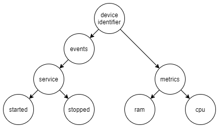

# Device Management with RabbitMQ

The goal of this exercise is to implement asynchronous service communication using a message broker. The application will focus on routing via topics, confirmations and communication between multiple implementation languages.

## Use Case

The implemented application provides a service which allows to monitor system resources and events of devices like servers or IoT devices. The application consists of the following three components.

- The `Agent` which is installed on a device to gather monitoring information and share them with the broker.
- The message broker.
- The `Watchdog` which subscribes himself to certain (or all) information the `Agents` provides and sends notifications when certain thresholds are exceeded or certain events occur. (e.g. CPU load is above a certain level)

For this exercise the `Agent` does not actually gather system information, instead it mimics one or more devices and generates random data for each of them.

## Application

The following image gives a basic overview of the systems components and how they interact with each other. How these components function will be described in this section.


### Data Exchange Format

Since producer and consumer are implemented in different languages, it is necessary to exchange the data in a language agnostic form. To solve this issue, the message format `protobuf` was chosen. This format is extremely interesting, not only because its language agnostic but also because messages can be serialized to a binary format. This makes it extremely efficient when sending it over the network.

### Broker

For the broker RabbitMQ was chosen. It was set up using the following docker compose, which allows for easy start up and shutdown. The chosen image also provides a RabbitMQ management UI.

```yml
version: "3.8"
services: 
    rabbitmq:
        image: rabbitmq:3.8.14-management
        container_name: 'rabbitmq'
        ports: 
            - 5672:5672
            - 15672:15672
        volumes:
            - ~/.docker-conf/rabbitmq/data/:/var/lib/rabbitmq/
            - ~/.docker-conf/rabbitmq/log/:/var/log/rabbitmq
```

### Agent

As already outlined in [Use Case](#use-case) the `Agent's` job is it to gather monitoring information of a device and send them to the broker. This application was implemented in C# and uses the `RabbitMQ.Client` library to communicate with the broker.

The following sections describe how the `Agent` is structured and how he communicates with the broker.

#### Architecture

The `Agent` basically consists of three components as already seen in the image in [Application](#application):

- multiple `SystemValueSources`
- `DeviceWatcher`
- `SystemValueApi`

##### SystemValueSource

The `SystemValueSources` build the base of the `Agent`. They provide the application with monitoring information, so called `SystemValues`, of the device (As already mentioned in [Use Case](#use-case),they are randomly generated for this exercise). Each `SystemValueSource` must implement the following interface, which defines a common event for publishing new `SystemValues`.

```C#
public interface ISystemValueSource<out T> where T : ISystemValue
{
    event Action<T> NewSystemValue;
}
```

For this application three sources for CPU, RAM and service events have been implemented. What information is included in each `SystemValue` can be seen below. Each `SystemValue` also contains the identifier of the device it was sent from. However this is set by the `DeviceWatcher` and not by each `SystemValueSource`.

- CPU
  - Load percentage
  - Temperature per core
  - power draw
- RAM
  - Total Mb
  - Used Mb
  - Memory Clock
- Service event
  - Executable path
  - Event type (Either started or stopped)

##### DeviceWatcher

The `DeviceWatcher` is the bridge between the `SystemValueSources` and the `SystemValueApi`. He is registered to all `SystemValueSources` and forwards the messages to the `SystemValueApi`.

##### SystemValueApi

The `SystemValueApi` abstracts the RabbitMQ library from the rest of the application. It provides a single `Publish` method which can be used by the application to publish `SystemValues` to the broker. The communication with the broker is described in detail in the next section.

#### Protobuf Usage

The `Agent` uses the `protobuf-net` library to transform objects into the `protobuf` format. It makes it possible to define a `protobuf` contract using `Attributes`, rather than having to generate code from `.proto` files. How such a `protobuf` contract is defined can be seen below.

In addition to that the `protobuf-net.BuildTools` library was used, which helps catch errors in `proto` definitions (e.g. multiple members with the same tag) at compile time.

```CSharp
[ProtoContract]
public class Cpu : IMetric
{
    [ProtoMember(1)] public int LoadPercentage { get; }
    [ProtoMember(2)] public int PowerDraw { get; }
    [ProtoMember(3)] public IList<int> CoreTemps { get; }
    [ProtoMember(10)] public string DeviceIdentifier { get; set; }

    public Cpu()
    {
    }

    public Cpu(int loadPercentage, int powerDraw, IList<int> coreTemps)
    {
        LoadPercentage = loadPercentage;
        PowerDraw = powerDraw;
        CoreTemps = coreTemps;
    }
}
```

How a `SystemValue` gets transformed to the `protobuf` can be seen below.

```CSharp
using var stream = new MemoryStream();
Serializer.Serialize(stream, payload);
var binary = stream.ToArray();
```

#### Broker Communication

The following sections describe the aspects of the communication with the broker.

##### Topic Routing

The communication from the producer to the broker is realized through a topic exchange. This allows the consumer to decide which types of messages he wants to receive.

The following image visualizes the concrete routing keys to which the `Agent` publishes his messages. A message is either an `event` or a `metric`. A drawback of this is, that it is difficult for a message to represent multiple types at once.



Another downside to this is, that `SystemValues` need to be explicitly mapped to the corresponding routing key as seen in the snippet below. This could lead to a lot of code if more `SystemValues` get introduced.

```CSharp
private static string GetKeyForType(ISystemValue systemValue) =>
systemValue switch
{
    Cpu => "metrics.cpu",
    Ram => "metrics.ram",
    ServiceEvent serviceEvent => GetKeyForServiceEvent(serviceEvent),
    _ => throw new ArgumentOutOfRangeException(nameof(systemValue))
};

private static string GetKeyForServiceEvent(ServiceEvent serviceEvent) =>
serviceEvent.ServiceEventType switch
{
    ServiceEventType.Start => "events.service.started",
    ServiceEventType.Stop => "events.service.stopped",
    _ => throw new ArgumentOutOfRangeException(nameof(serviceEvent))
};
```

##### Confirmation

As already mentioned the communication with the broker is abstracted by the `SystemValueApi`. This class provides a single `Publish` method which can be used to send a message to the broker. When calling this method the caller can also define if the message should be acknowledged or not. This is necessary since messages like service events might only occur once and it is critical that the broker receives and handles those messages.

How the RabbitMQ confirmation process works in general and how it is implemented in the `Agent` is described in the following two sections.

###### Basics

When sending messages to a RabbitMQ broker it is possible to request a response if the broker accepted or declined a message. For this the channel on which the message is sent must be put in the confirm mode. When this is done, both the publisher and the broker will count the messages sent over this channel starting from one. When the broker acks or nacks a message he will send the number of the message back to the producer on the same channel. The broker can additionally send a `multiple` flag which indicates that all messages till the given number have been handled or declined.

###### Implementation

To implement this acknowledgement behaviour the `SystemValueApi` needs two separate channels. One in confirm mode and one in the default mode. To do this in C# the `ConfirmSelect` needs to be called on the channel object. To react to the brokers response the C# RabbitMQ library exposes two events `BasicAcks` and `BasicNacks`. Both events contain the message number as well as the multiple flag.

Every time the `SystemValueApi` send a message which needs to get confirmed it stores this message in a `ConcurrentDictionary`. The key is the message number and the value is the `SystemValue`. The current message number can be requested by calling `NextPublishSeqNo` on the channel object. Whenever `BasicAcks` or `BasicNacks` fires an event the message in question will be removed from the dictionary. In case the message was nacked it will be resent.

The relevant implementation parts can be seen below. The full source code can be seen in `Agent/Agent.Core/SystemValueApi/SystemValueApi.cs`

```C#
/* Setup delegates */
_confirmChannel.BasicAcks += (_, args) => HandleConfirmation(args.DeliveryTag, args.Multiple, false);
_confirmChannel.BasicNacks += (_, args) => HandleConfirmation(args.DeliveryTag, args.Multiple, true);

/* HandleConfirmation method */
private void HandleConfirmation(ulong tag, bool multiple, bool nack)
{
    var resume = true;
    while (resume && _ackMap.ContainsKey(tag) && _ackMap.TryRemove(tag, out var queued))
    {
        if (nack)
        {
            Publish(queued, true);
        }

        resume = multiple;
        tag--;
    }
}

/* Storing message */
_ackMap.TryAdd(_confirmChannel.NextPublishSeqNo, payload);
```

### Watchdog

As described in [Use Case](#use-case) the `Watchdogs` purpose is to consume `SystemValues` and notify the user if certain conditions are met. For example if a value is above a certain threshold. This application is implemented using Kotlin. Since there is no dedicated Kotlin RabbitMQ library it uses the Java `amqp-client` library.

How the `Watchdog` is structured and how he communicates with the broker will be described below.

#### Architecture

As already seen in the image in [Application](#application) consists the `Watchdog` of three main components:

- `SystemValueApi`
- `Watchdog`
- `NotificationStrategy`

Same as on the producer side is the `SystemValueApi` an abstraction of the RabbitMQ library. The `Watchdog` is subscribed to the `SystemValueApi` to receive new `SystemValues`. He checks those values against a user defined configuration. If certain conditions are met (e.g. CPU load is above a certain threshold) he passes the information to the defined `NotificationStrategy`. For this application only a `ConsoleNotificationStrategy` was implemented, which prints the information to the console.

#### Protobuf Usage

The `Watchdog` uses the `kotlinx-serialization-protobuf` library. This library works similar to the one used in the `Agent` as it allows to use `Annotations` to define a proto contract (see snippet below). A downside of this library is that it only supports the `proto2` spec as of right now. Additionally it is required to set default values for some types. This is because `proto` doesn't serialize default values for scalar types. When for example the `loadPercentage` is `0` it won't be serialized and sent over the wire. However since types in Kotlin can't have default values an explicit value must be defined.

```Kotlin
@Serializable
data class Cpu(
    @ProtoNumber(1) val loadPercentage: Int = 0,
    @ProtoNumber(2) val powerDraw: Int = 0,
    @ProtoNumber(3) val coreTemps: List<Int>,
    @ProtoNumber(10) override val deviceId: String,
) : SystemValue()
```

How a `proto` message can be deserialized into an object can be seen below.

```Kotlin
val cpu = ProtoBuf.decodeFromByteArray<Cpu>(byteArray)
```

#### Broker Communication

The communication from the broker to the `Watchdog` is much simpler than from the `Agent` to the broker. The only steps necessary are:

1. creating a channel
2. declare a queue for the channel (By calling the parameterless method `queueDeclare` a exclusive, non-durable autodelete queue with a generated name is created)
3. bind the queue to all user defined routing keys

After that the consumer can start listening by calling `basicConsume` on the channel. This method takes the name of the queue, the auto acknowledge flag and a delivery and shutdown callback. The auto acknowledge flag tells the broker if he can consider messages acknowledged as soon as they are delivered. This was set to `false` in the `Watchdog` implementation. Instead all messages are acknowledged manually. This can be seen in the snippet below.

At first the protobuf message is decoded using `decode` and then passed to the higher ordered function `onValue`. As soon as the `SystemValue` has been processed the `channel.basicAck` is called to acknowledge the message. If an exception is thrown the message is nacked. Depending on which exception was thrown the message is requeued or not. For this the `MessageProcessingException` was implemented, which signals that the message cannot be processed and should not be requeued. Any other exception will lead to a requeuing of the message.

```Kotlin
fun startConsume(onValue: (SystemValue) -> Unit) {
        val deliverCallback = DeliverCallback { _, delivery ->
            try {
                decode(delivery.envelope.routingKey, delivery.body)?.let {
                    onValue(it)
                }
                channel.basicAck(delivery.envelope.deliveryTag, false)
            } catch (_: MessageProcessingException) {
                channel.basicNack(delivery.envelope.deliveryTag, false, false)
            } catch (_: Exception) {
                channel.basicNack(delivery.envelope.deliveryTag, false, true)
            }
        }

        channel.basicConsume(queueName, false, deliverCallback) { _, sig ->
            eprintln("Shutdown: ${sig.message}")
        }
    }
```

## Conclusion

RabbitMQ is really great for implementing asynchronous communication.
It is very easy to set up and also easy to use.
There are a lot of client libraries for different languages and frameworks which makes its very easy to setup communication between different implementations.
Since RabbitMQ makes no assumption about the sent data, using a language agnostic format is a noissue.
In addition to that RabbitMQ provides a comprehensive documentation with source code examples which really speeds up development.

The communication through a topic exchange is very simple. The consumer only needs to define the routing key, in which he can use wildcards.
However only two wildcards `*` (substitute one word) and `#` (substitute zero or more words) are supported, regex patterns like `device-(1|4)` are not possible. Although this could be mimicked by binding a queue to multiple routing keys. Another issue is that there is no way for the consumers to "discover" the routing keys to which messages have been published. There is also no way for consumers to know the contents of each message since there is no "API contract".

RabbitMQ has a very fine grained API for handling confirmations. Confirmations can be sent for each message or in bulk. It can also be handed off to RabbitMQ (which might not be optimal depending on the use-case). This allows the developer to implement custom confirmation logic depending on the use case.